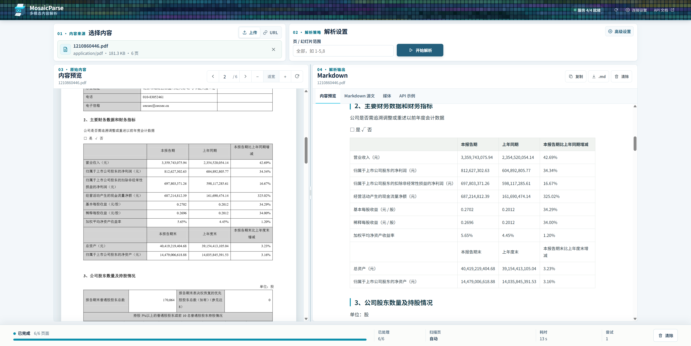

<p align="center">
  
</p>

# MosaicParse

MosaicParse 是一个自托管的多模态内容解析服务，用在 PDF、Office 文档、图片或视频与
RAG 等下游系统之间。

它解决的问题很直接：不同文件格式需要不同的处理工具，而把详细坐标和解析器内部对象
直接交给业务 LLM 又慢又难用。MosaicParse 在内部利用版面、坐标和多模型证据完成解析，
最终只输出一份普通 GFM Markdown：保留标题、段落、列表、表格和页间连续关系，不再把
表格二次改写为专用 XML 或文档 JSON。图片和视频以标准 Markdown 列表及下载链接保留。

服务会根据文本层、页面布局、OCR 和视觉信号自动选择处理方式。文档内嵌图片始终作为
可下载资产保留，模型描述默认关闭并可通过 `describe_images=true` 按需启用；独立视频
通过 FFmpeg 采样关键帧，摘要只基于这些采样内容。
任务状态、错误和无坐标资产清单仍使用 JSON 控制协议；文档内容只有 Markdown。



## 项目边界

本项目负责恢复“内容中可见了什么、结构如何”；它不负责表格业务语义重写、Embedding、
索引、问答、实体消歧、领域关系或事件 ontology。

## 功能

- PDF、DOCX、PPTX、PNG、JPEG、WebP、TIFF、BMP 及 MP4、MOV、MKV、WebM、AVI；
- 文档内嵌图片提取、去重、按需描述与下载；独立视频关键帧和仅基于采样帧的摘要；
- 单一自动解析策略；可显式跳过扫描 PDF 页并只保留页面图像；
- 唯一的 GFM Markdown 文档结果；坐标和候选证据只在单次解析内部使用；
- 表格保留为 GFM，并在导出前合并可确定的跨页连续表；多级/重复表头按识别结果保留，
  不用固定首行表头或领域规则重新解释单元格；
- 小文件同步解析，异步 Job、持久化状态和 SSE 进度；
- `/health`、`/ready`、后端能力探测、Swagger、ReDoc；
- MCP 2.x Streamable HTTP；
- API Key、独立 Admin Token、上传校验和 SSRF 防护；
- CPU-only 主镜像，以及 GPU 模型服务分离部署。

## 快速开始：CPU-only

默认配置不启动也不要求 GLM，数字原生 PDF 可独立解析：

```bash
cp .env.example .env
docker compose up -d --build mosaicparse
docker compose ps
```

打开：

- Web UI: <http://localhost:12303/>
- Swagger: <http://localhost:12303/docs>
- ReDoc: <http://localhost:12303/redoc>
- Health: <http://localhost:12303/health>
- MCP: <http://localhost:12303/mcp>

首次转换会下载 Docling 布局/表格模型，`/ready` 在初始化期间可能暂时返回
非 2xx。MosaicParse 健康检查为首次下载/初始化保留 10 分钟 `start_period`。
模型保存在 Compose 命名卷中，重启不会重复下载。

容器使用 `DOCLING_LOCAL_ARTIFACTS_PATH` 作为本服务的离线目录配置。不要在
空目录上设置上游同名变量 `DOCLING_ARTIFACTS_PATH`，否则 Docling 会将其视为
已准备好的离线目录并关闭自动下载。

同步解析一个自制测试 PDF：

```bash
curl --fail-with-body http://localhost:12303/v1/content/parse \
  -F file=@tests/fixtures/native-report.pdf \
  -F scan_policy=auto \
  -F language=zh,en \
  -o result.md
```

## 三种部署模式

| 模式 | 主服务 | OCR/VLM | 启动方式 |
|---|---|---|---|
| CPU-only | 本项目 CPU 镜像 | 关闭；适合数字 PDF/Office | `docker compose up -d --build mosaicparse` |
| 本机 GLM | CPU 主服务 | Compose 可选服务中的独立 vLLM，默认 GPU 1 | `docker compose --profile glm up -d --build` |
| 完整 GLM SDK | CPU 主服务 + CPU 布局 sidecar | 复用 GPU 1 的 GLM-OCR | `docker compose --profile glm-sdk up -d --build` |
| 远程后端 | CPU 主服务 | 远程 GLM 和/或既有 VLM | 配置 URL 后只启动 `mosaicparse` |

### 本机 GLM-OCR（GPU 1）

编辑 `.env`：

```dotenv
GLM_OCR_ENABLED=1
GLM_GPU_DEVICE_ID=1
GLM_DTYPE=half
GLM_GPU_MEMORY_UTILIZATION=0.40
```

然后：

```bash
docker compose --profile glm up -d --build
docker compose logs -f glm-ocr
curl --fail http://localhost:8001/health
```

Compose 将 GPU `device_ids` 默认锁到 `1`。参考主机的 GPU 1 是 RTX 2080 Ti
（Turing，不支持 BF16），因此 vLLM 默认使用 FP16 `--dtype half`。主 parser
仍不挂载 GPU，也不包含 CUDA 依赖。

### GLM SDK＋Qwen 区域视觉融合

`docling-glm-ocr` 插件和官方 `glmocr` SDK 复用同一个 GLM-OCR 识别模型。SDK
sidecar 在 CPU 上运行 PP-DocLayoutV3；页面先按检测方向旋正，再生成表格候选。确定性
质量门控会直接接受干净表格，只把少量冲突行交给 Qwen；多级表头或全局拓扑失败才执行
全表视觉兜底。

```dotenv
GLM_SDK_ENABLED=1
VISUAL_ROUTER_ENABLED=1
VLM_ENABLED=1
VLM_MODEL=qwen3.6-docparse:35b-32k
```

```bash
docker compose --profile glm-sdk up -d --build
curl --fail http://localhost:12303/v1/backends
```

默认 `scan_policy=auto` 自动处理复杂扫描/混合表、横置表及签章页；数字原生 PDF
继续使用 Docling 原生文本和 TableFormer，不做无条件 GLM-OCR。局部复核最多一次
Qwen，完整兜底仍受每页 3 次、180 秒预算限制。`scan_policy=skip` 会关闭 PDF 扫描
OCR/视觉增强，将检测到的扫描页保存为整页资产并在 Markdown 中明确标记跳过。

### 远程 GLM / Ollama

```dotenv
GLM_OCR_ENABLED=1
GLM_OCR_API_URL=http://gpu-host:8000/v1/chat/completions
GLM_OCR_MODEL=zai-org/GLM-OCR

VLM_ENABLED=1
VLM_BASE_URL=http://ollama-host:11434/v1
VLM_MODEL=qwen3.6-docparse:35b-32k
VLM_PAGE_BUDGET_SECONDS=180
VLM_MAX_CALLS_PER_PAGE=3
VLM_REGION_MAX_TOKENS=16384
```

`VLM_ENABLED=0` 始终禁止所有 Qwen 出站调用。视觉诊断仅记录调用数、耗时、
区域/表格/单元格和冲突计数，不记录图像、正文、prompt 或 reasoning 正文。

```bash
docker compose up -d --build mosaicparse
curl --fail http://localhost:12303/v1/backends
```

完整部署、显卡校验、离线模型与反向代理说明见
[docs/deployment.md](docs/deployment.md)。

## API 概览

| 方法 | 路径 | 用途 |
|---|---|---|
| `POST` | `/v1/content/parse` | 小内容同步并持久化；视频/大输入自动返回 202 |
| `POST` | `/v1/content/jobs` | 创建异步任务 |
| `GET` | `/v1/content/jobs/{job_id}` | 查询持久化状态 |
| `GET` | `/v1/content/jobs/{job_id}/events` | SSE 进度 |
| `GET` | `/v1/content/jobs/{job_id}/result` | 获取/下载 GFM Markdown |
| `GET` | `/v1/content/jobs/{job_id}/assets` | 列出图片、视频与关键帧资产 |
| `GET` | `/v1/content/jobs/{job_id}/assets/{asset_id}` | 鉴权下载资产；视频支持 Range |
| `GET` | `/v1/content/jobs/{job_id}/bundle` | 按需生成 manifest 与资产 ZIP |
| `POST` | `/v1/content/jobs/{job_id}/retry` | 重试失败任务 |
| `DELETE` | `/v1/content/jobs/{job_id}` | 取消或删除任务 |
| `GET` | `/v1/backends` | 后端真实能力状态 |
| `GET` | `/health`, `/ready` | 存活与就绪检查 |
| `GET/POST` | `/mcp` | MCP Streamable HTTP |
| `POST` | `/admin/reload`, `/admin/cleanup` | 管理操作 |

请求参数、状态机、SSE 和错误协议见 [docs/api.md](docs/api.md)，在线 Schema
以 `/openapi.json` 为准。

若设置 `API_KEY`，公共受保护接口推荐使用：

```http
Authorization: Bearer <API_KEY>
```

`X-API-Key` 也可用作客户端兼容别名。管理接口始终使用独立的：

```http
X-Admin-Token: <ADMIN_TOKEN>
```

不要复用两个密钥，也不要把密钥放进 URL、Dockerfile 或日志。

## MCP

MCP 使用 Python SDK 2.x 的 Streamable HTTP 传输，暴露解析、任务状态、Markdown
结果和资产工具。大文件使用受控 `source_url`；MCP 不接受任意本地文件路径。

MCP v2 会校验 Host 和 Origin 防止 DNS rebinding。通过公网域名/反向代理
暴露时，必须把精确 `host[:port]` 和 Origin 添加到：

```dotenv
MCP_ALLOWED_HOSTS=localhost,127.0.0.1,[::1],mosaicparse,docs.example.com
MCP_ALLOWED_ORIGINS=http://localhost,http://127.0.0.1,https://docs.example.com
```

默认不使用通配符。

## 本地开发

需要 Python `>=3.13,<3.14`、uv、Node 20：

```bash
uv sync --frozen
npm --prefix frontend ci
npm --prefix frontend run build
DATA_DIR=./data STATIC_DIR=frontend/dist GLM_OCR_ENABLED=0 \
  uv run uvicorn app.main:app --host 0.0.0.0 --port 12303
```

依赖基线经过 Python 3.13 解算并提交在 `uv.lock`：

| 组件 | 锁定版本 |
|---|---:|
| Docling | `2.119.0` |
| docling-glm-ocr | `0.5.0` |
| FastAPI | `0.141.1` |
| MCP Python SDK | `2.0.0` |
| PyTorch CPU | `2.13.0+cpu` |
| vLLM GLM image | `v0.19.1` |

主服务的 PyTorch/torchvision 从官方 CPU wheel 索引锁定；`uv.lock` 不含
`nvidia-*` 或 CUDA Python 包。

CPU 基线使用 `DOCLING_COMPILE_MODELS=0`，避免首次文档触发耗时很长的
`torch.compile`；只应在固定硬件上完成预热与基准验证后开启。远程 VLM
默认 `VLM_MAX_RETRIES=1`，防止超时/过载时形成长时间重试风暴。

原生文本 PDF 可通过 `DOCLING_PAGE_WORKERS` 做单文档页级并行。每个 worker
持有一个启动期加载、请求间复用的 Docling 转换器，单转换器线程数由
`DOCLING_NUM_THREADS` 控制。服务只对连续、达到
`DOCLING_PAGE_PARALLEL_MIN_PAGES` 且每页原生文本充足的 PDF 分片；扫描、混合、
稀疏选页和短文档自动走单转换器路径。缓存转换器总数为
`PARSER_WORKERS * DOCLING_PAGE_WORKERS`，配置上限为 32；调大前须同时核算 CPU 和内存。

## 验证

```bash
uv lock --check
uv sync --frozen
uv run ruff check .
uv run mypy app
uv run pytest --cov=app
uv run python scripts/export_openapi.py --check
uv run python scripts/generate_fixtures.py --check

npm --prefix frontend ci
npm --prefix frontend run lint
npm --prefix frontend run typecheck
npm --prefix frontend run test
npm --prefix frontend run build

docker compose config --quiet
docker build -t mosaic-parse:local .
```

CI 不下载或运行大模型；GLM/Ollama 错误路径由 mock 服务覆盖。真实 GPU
回归应在专用环境执行。夹具全部由本项目脚本生成，不包含第三方文档原文，
详见 [tests/fixtures/README.md](tests/fixtures/README.md)。

## 设计与许可证

- [架构](docs/architecture.md)
- [API](docs/api.md)
- [部署](docs/deployment.md)
- [基准测试](docs/benchmark.md)
- [项目 0.4.0 设计规格](docs/project-spec.md)

本项目代码使用 [Apache License 2.0](LICENSE)。Docling、GLM-OCR、模型权重
和容器镜像拥有各自许可证；部署者需要分别核查并遵守其版本对应条款。
